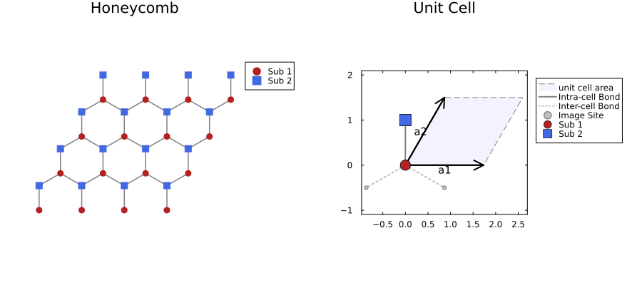

# Lattice2D.jl

[](https://sotashimozono.github.io/Lattice2D.jl/dev/)
[](https://julialang.org)
[](https://github.com/invenia/BlueStyle)
[](https://codecov.io/gh/sotashimozono/Lattice2D.jl)
[](https://github.com/sotashimozono/Lattice2D.jl/actions/workflows/CI.yml?query=branch%3Amain)
[](https://opensource.org/licenses/MIT)

## Features

This package provides two dimensional lattices. If you know unit cell information (basic vectors, connection), you can construct arbitrary lattices.

Available lattices by defaults are ...

- Square lattice
- Triangular lattice
- Honeycomb lattice
- Kagome lattice
- Lieb lattice
- Shastry-Sutherland lattice

## Installation

```julia
using Pkg
Pkg.add("Lattice2D")
```

## Example

Here we show Honeycomb lattice as an example. The Module enables us to have unit cell informations and connection infos, reciprocal vectors etc. And more, we can know the graph is bipartite or not, we can set periodic boundary and open boundary.

```julia
using Lattice2D

# Create a 4x4 Honeycomb lattice with Periodic Boundary Conditions (PBC)
lat = build_lattice(Honeycomb, 4, 4; boundary=PBC())

# Check basic properties
println("Total sites: ", lat.N)
println("Is bipartite? ", lat.is_bipartite)
```



## Plots dependency

`Lattice2D` re-exports `materialize` and `require_finite` from
`LatticeCore`. Plotting helpers (e.g. via `Plots.plot(lat)`) are
provided through `LatticeCore`'s `LatticeCorePlotsExt` package
extension, which activates only when both `LatticeCore` and `Plots`
are loaded. As a result:

- A user that only computes neighbours / bonds / plaquettes / momenta
  does **not** need `Plots` and pays no precompilation cost for it.
- A user that wants visualisation should `using Plots` alongside
  `using Lattice2D`; the recipe / plot method is then picked up
  automatically.

The `docs/` build environment loads `Plots` explicitly so the gallery
figures are rendered; see `docs/src/Gallery.md` for visualisation
examples.

> Note: `Project.toml` currently lists `Plots` as a regular dependency
> for backward compatibility with downstream code that imports it
> transitively. Migrating it to a `[weakdeps]` extension is tracked
> separately and will be a breaking release.

## Contributing

Contributions are welcome! Please feel free to open an Issue or submit a pull requests.
