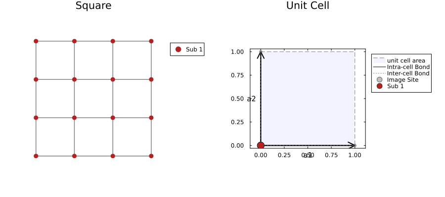
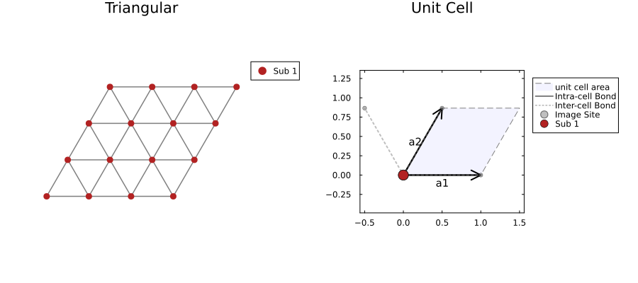
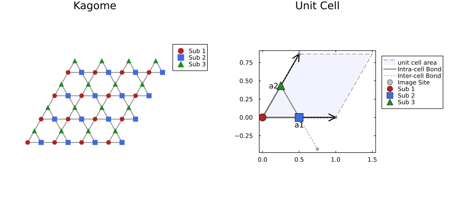
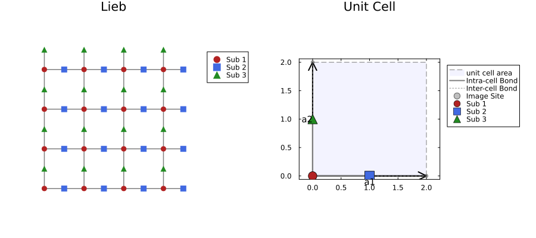
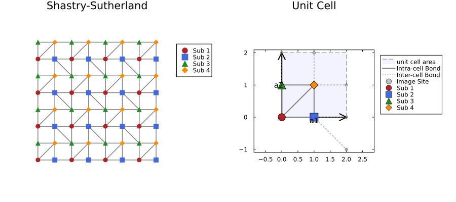
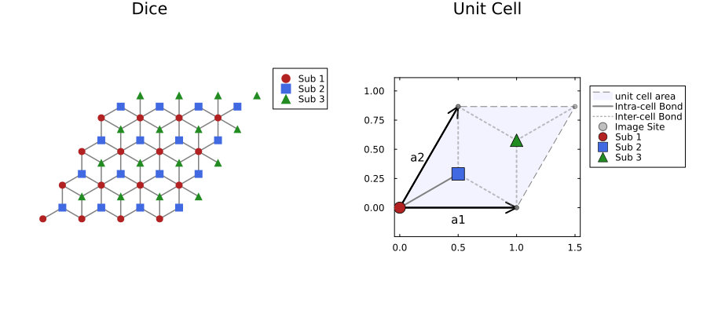
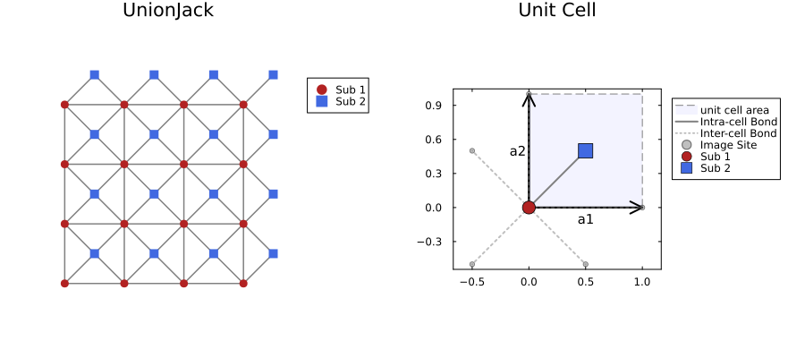
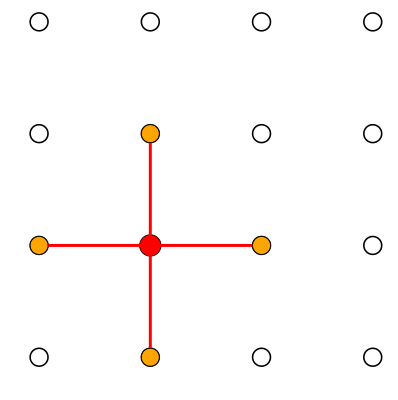
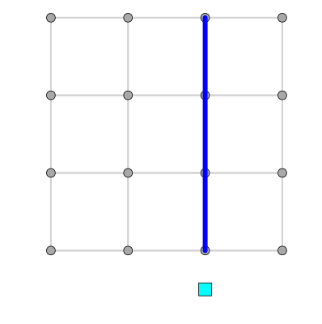
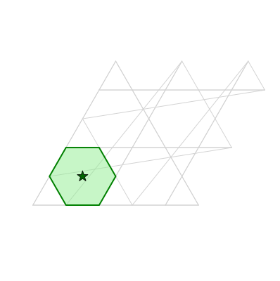

# Supported Lattices

`Lattices.jl` provides lattices showed below. In each figure, left side shows lattice shape, and right side shows definition of unit cells.  

## Square lattice

The most fundamental 2D bipartite lattice with coordination number $z=4$.
It has a single site per unit cell and does not exhibit geometric frustration. Often used as a standard benchmark for 2D quantum many-body algorithms.

## Triangular lattice

A lattice consisting of equilateral triangles with coordination number $z=6$.
It is a prototypical example of a geometrically frustrated lattice (non-bipartite), famous for the $120^\circ$ magnetic order in the Heisenberg model.

## Honeycomb lattice

A hexagonal lattice structure found in Graphene.
It is a bipartite lattice with coordination number $z=3$ and contains **2 sites** (sublattices A and B) in the unit cell.

## Kagome lattice

A lattice consisting of corner-sharing triangles with coordination number $z=4$.
It contains **3 sites** in the unit cell. Known for strong geometric frustration and as a candidate host for Quantum Spin Liquids (QSL).

## Lieb lattice

A lattice formed by removing the center sites from a $2 \times 2$ cluster of the square lattice, or decorating the edges of a square lattice.
It is a bipartite lattice characterized by a **flat band** in its energy spectrum and ferrimagnetic ground states (Lieb's theorem).

## Shastry-Sutherland lattice

A square lattice with additional orthogonal diagonal bonds (dimers).
It is geometrically frustrated and realized in the material $\text{SrCu}_2(\text{BO}_3)_2$. The model is famous for having an exact dimer-singlet ground state in a certain parameter region.

## Dice lattice

A bipartite lattice that is the dual of the Kagome lattice.
It contains **3 sites** per unit cell, separated into a single 6-coordinated site ("hub") and two 3-coordinated sites ("rims").

## Union Jack lattice

A square lattice with diagonal bonds added to alternating faces, visually resembling the Union Jack flag.
It is a non-bipartite lattice with strong geometric frustration.

# Geometric Features and Selections

`Lattice2D.jl` (via `LatticeCore.jl`) provides a geometric abstraction API for interacting with element locations, identifying spatial connectivity, and selecting parts of the lattice. Below are visualizations of how sites, bonds, and plaquettes are treated.

## Site Specifications and Neighbors

Sites in the lattice are mapped directly to physical coordinates `(x, y)`. The neighbor API automatically determines connectivity based on the topological rules (or distance thresholds if `Aperiodic`).

Below, a central site is highlighted (red) alongside its immediate structural neighbors (orange) identified by `neighbors(lattice, target_site)`.

## Bond Specification

Bonds are stored as structurally directed edges between sites. Each bond can be accessed and manipulated individually, and we can query properties such as `bond_center`, allowing models to map variables directly to the edges of the lattice (e.g., lattice gauge theories or dimeric models).

Below, a specific bond is highlighted (blue) spanning from site `i` to site `j`, and its `bond_center` is marked in cyan.

## Plaquette Specification

The API identifies elemental cycles or "faces" of the lattice, referred to as **plaquettes**. You can iterate through all `plaquettes(lattice)`, picking out individual faces. Each plaquette has a `center` and an ordered list of `vertices` bounding the face.

Below, one plaquette from the `Kagome` lattice is selected and shaded (green), with its exact geometrical center marked.

